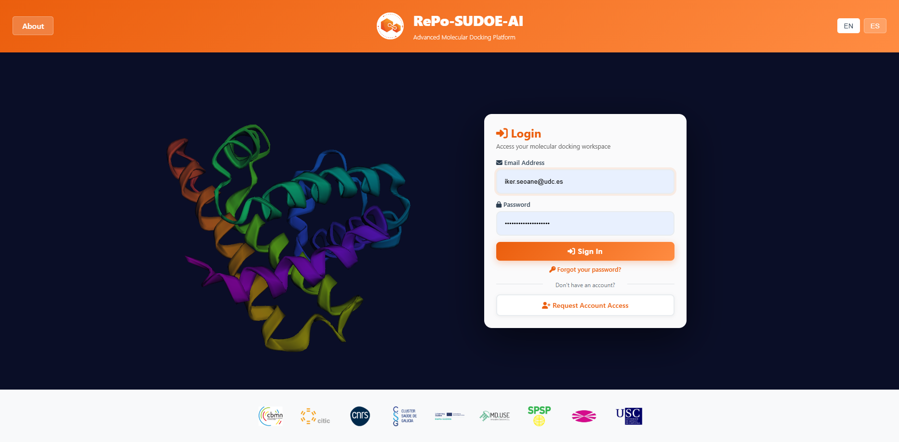
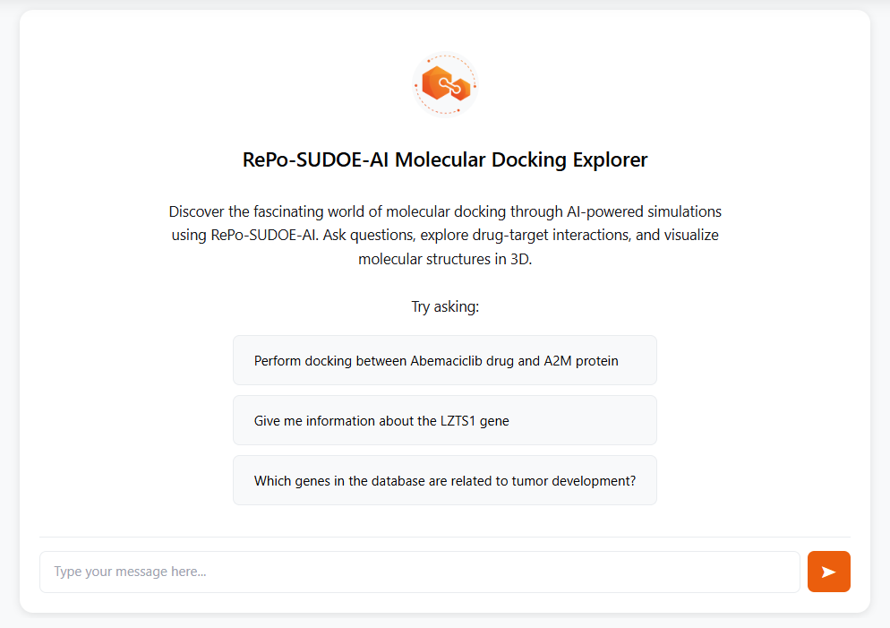
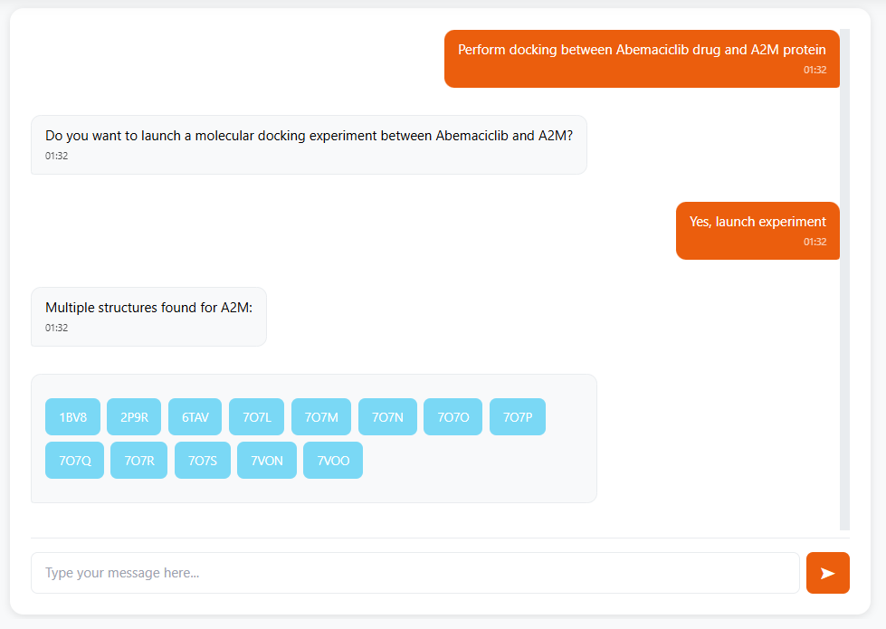
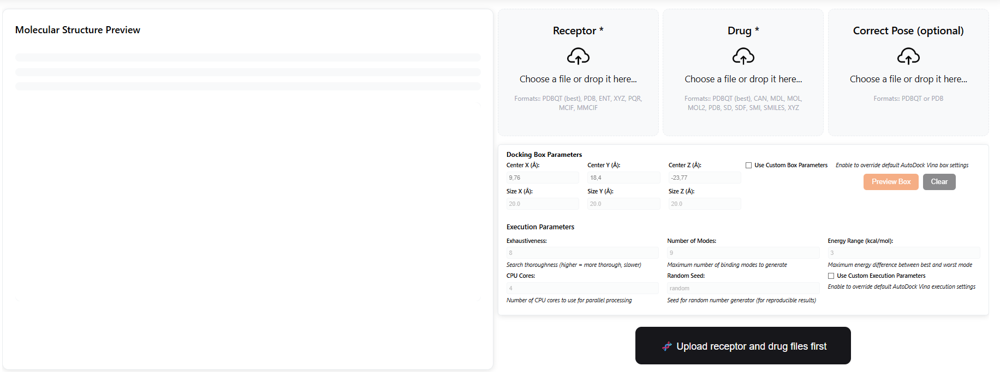
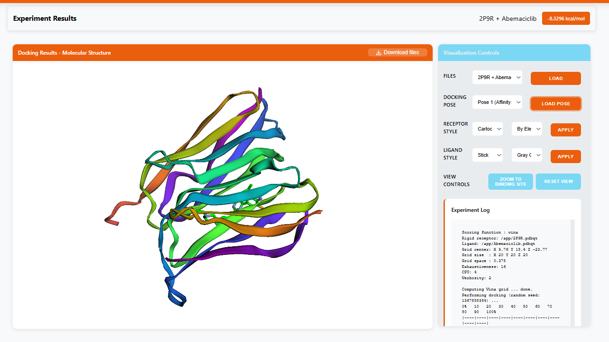

# RePo-SUDOE-AI

<div align="center">


**Plataforma web de docking molecular asistida por IA**  
*Web platform for AI-assisted molecular docking*

[English](#english) · [Español](#español)

</div>

---

## Screenshots

| Login | Chat AI |
|-------|---------|
|  |  |

| Solicitud de docking por chat | Modo manual — parámetros |
|-------------------------------|--------------------------|
|  |  |

| Resultados — visualización 3D |
|-------------------------------|
|  |

---

<a name="español"></a>
## 🇪🇸 Español

### ¿Qué es RePo-SUDOE-AI?

RePo-SUDOE-AI es una plataforma web que permite realizar experimentos de **docking molecular** (acoplamiento proteína-ligando) de forma accesible, integrando el motor [AutoDock Vina](https://vina.scripps.edu/) con modelos de inteligencia artificial para facilitar la interpretación de resultados.

Desarrollado como Trabajo de Fin de Grado (TFG) en el marco del proyecto SUDOE, el sistema permite a investigadores y estudiantes:

- Subir ficheros de receptor (proteína) y ligando en formato `.pdbqt`
- Ejecutar simulaciones de docking molecular con AutoDock Vina (aislado en Docker)
- Consultar los resultados vía chat con un asistente de IA (OpenAI, Anthropic, Google o Ollama local)
- Visualizar las estructuras moleculares en 3D en el navegador

### Stack tecnológico

| Capa | Tecnología |
|------|-----------|
| Backend | Python 3.11 + Django 4.2 |
| Frontend | TypeScript 5 + Vite + Tailwind CSS |
| Base de datos | PostgreSQL 15 |
| Motor de docking | AutoDock Vina 1.2.x (via Docker) |
| IA | OpenAI / Anthropic / Google Gemini / Ollama |
| Infraestructura | Docker + Docker Compose |
| Servidor ASGI | Daphne (producción) / Django runserver (desarrollo) |

### Requisitos del sistema

- Python 3.11+
- Node.js 20+ y npm
- Docker Engine 24+ y Docker Compose v2
- PostgreSQL 15+ (o usar el servicio Docker del compose)
- 4 GB de RAM mínimo (8 GB recomendado si se usa Ollama)

### Instalación

#### Con Docker (recomendado)

```bash
# 1. Clonar el repositorio
git clone https://github.com/isecu33/RePo-SUDOE-AI.git
cd RePo-SUDOE-AI

# 2. Configurar variables de entorno
cp .env.example .env
# Editar .env con tu editor favorito y añadir tu API key

# 3. Construir el frontend
cd frontend && npm install && npm run build && cd ..

# 4. Levantar todos los servicios
docker compose up -d

# 5. Aplicar migraciones y crear superusuario
docker compose exec web python manage.py migrate
docker compose exec web python manage.py createsuperuser
```

La aplicación estará disponible en `http://localhost:8000`.

#### Sin Docker (desarrollo local)

```bash
# 1. Clonar e instalar dependencias Python
git clone https://github.com/isecu33/RePo-SUDOE-AI.git
cd RePo-SUDOE-AI
python -m venv venv
source venv/bin/activate          # Windows: venv\Scripts\activate
pip install -r requirements.txt

# 2. Instalar dependencias frontend
cd frontend && npm install && cd ..

# 3. Configurar entorno
cp .env.example .env
# Editar .env — necesitas PostgreSQL local o cambiar DB_ENGINE a sqlite

# 4. Migraciones
python manage.py migrate
python manage.py createsuperuser

# 5. Arrancar el frontend en modo watch
cd frontend && npm run dev &

# 6. Arrancar Django
python manage.py runserver
```

### Configuración

Copia `.env.example` a `.env` y ajusta los valores:

```bash
cp .env.example .env
```

Los campos obligatorios son:
- `SECRET_KEY` — clave secreta de Django (genera una con `python -c "from django.core.management.utils import get_random_secret_key; print(get_random_secret_key())"`)
- `DB_*` — credenciales de la base de datos
- `OPENAI_API_KEY` (o la clave del proveedor que uses)

Consulta `.env.example` para la documentación completa de cada variable.

### Ejecución en desarrollo

```bash
# Backend
python manage.py runserver

# Frontend (en otra terminal)
cd frontend && npm run dev

# (Opcional) Celery worker para jobs asíncronos
celery -A config worker --loglevel=info
```

### Build de producción

```bash
# Build del frontend
cd frontend && npm run build && cd ..

# Levantar con Docker Compose (modo producción)
docker compose --profile production up -d
```

### Estructura del proyecto

```
RePo-SUDOE-AI/
├── accounts/              # App Django: autenticación y gestión de usuarios
│   ├── models.py          # CustomUser, perfil y gestión de acceso
│   ├── views.py           # Login, registro, aprobación de cuentas
│   ├── forms.py           # Formularios de registro y configuración
│   ├── middleware.py      # Control de acceso por estado de cuenta
│   ├── templates/         # Templates: login, registro, emails de notificación
│   └── migrations/
├── config/                # Configuración central de Django
│   ├── settings.py        # Settings (DB, i18n, email, IA, Vina)
│   ├── urls.py            # URLs raíz
│   ├── wsgi.py
│   └── asgi.py
├── core/                  # App Django: lógica de negocio principal
│   ├── models.py          # Experimentos, resultados de docking
│   ├── views.py           # API endpoints (docking, chat, resultados)
│   ├── urls.py
│   ├── data/
│   │   ├── drugs/         # Base de datos de fármacos (xlsx)
│   │   └── genes/         # Base de datos de genes y estructuras (xlsx)
│   └── services/
│       ├── vina_service.py          # Integración con AutoDock Vina (Docker)
│       ├── query_handler.py         # Procesamiento de queries de chat con IA
│       ├── molecular_utils.py       # Utilidades de preprocesado molecular
│       └── visualizer_file_manager.py # Gestión de ficheros para el visualizador 3D
├── frontend/              # App Django: templates + TypeScript
│   ├── src/               # Código fuente TypeScript (compilado con Vite)
│   │   ├── main.ts        # Punto de entrada
│   │   ├── chat.ts        # Módulo de chat con IA
│   │   ├── docking.ts     # Módulo de docking
│   │   ├── event_bus.ts   # Bus de eventos tipado
│   │   └── types/         # Interfaces TypeScript
│   ├── static/frontend/
│   │   ├── js/            # Módulos JS (config, chat, docking, navigation…)
│   │   ├── css/           # Estilos compilados
│   │   └── img/           # Imágenes y logos de instituciones
│   └── templates/frontend/
│       ├── index.html     # Interfaz principal (chat + docking)
│       └── 3Dvizualiser.html # Visualizador 3D embebido
├── input/                 # Estructuras de receptores (PDB) y ligandos (SDF) de muestra
├── locale/                # Traducciones i18n (EN/ES)
├── docs/                  # Screenshots y documentación visual
├── .env.example           # Plantilla de variables de entorno
├── .gitignore
├── CONTRIBUTING.md
├── ROADMAP.md             # Plan de desarrollo por fases
├── docker-compose.yml
├── Dockerfile
├── nginx.conf
├── gunicorn.conf.py
└── requirements.txt
```

### Contribuir

¡Las contribuciones son bienvenidas! Consulta [CONTRIBUTING.md](CONTRIBUTING.md) para el proceso de Pull Request, convenciones de código y cómo configurar el entorno de desarrollo.

### Licencia

Distribuido bajo la licencia [Apache License 2.0](LICENSE).

### Créditos

- **Autor**: Iker Esguay — TFG Ingeniería Informática
- **Tutores**: Proyecto SUDOE-AI, Universidad
- **Motor de docking**: [AutoDock Vina](https://vina.scripps.edu/) — Scripps Research Institute
- **Imagen Docker Vina**: [cafernandezlo/dock-tools](https://hub.docker.com/r/cafernandezlo/dock-tools) — Carlos Fernández-Lozano, UDC

---

<a name="english"></a>
## 🇬🇧 English

### What is RePo-SUDOE-AI?

RePo-SUDOE-AI is a web platform for performing **molecular docking** (protein-ligand binding simulation) experiments, integrating [AutoDock Vina](https://vina.scripps.edu/) with AI language models to assist researchers in interpreting docking results.

Developed as a Final Degree Project (TFG) within the SUDOE project framework, the system allows researchers and students to:

- Upload receptor (protein) and ligand files in `.pdbqt` / `.pdb` / `.sdf` format
- Run molecular docking simulations using AutoDock Vina (containerized in Docker)
- Query results via AI chat assistant (OpenAI, Anthropic, Google, or local Ollama)
- Visualize molecular structures in 3D directly in the browser
- Explore a built-in database of anticancer drugs and gene targets

### Quick Start

```bash
git clone https://github.com/isecu33/RePo-SUDOE-AI.git
cd RePo-SUDOE-AI
cp .env.example .env   # fill in your API key and DB credentials
cd frontend && npm install && npm run build && cd ..
docker compose up -d
docker compose exec web python manage.py migrate
docker compose exec web python manage.py createsuperuser
# → open http://localhost:8000
```

### License

[Apache License 2.0](LICENSE)
