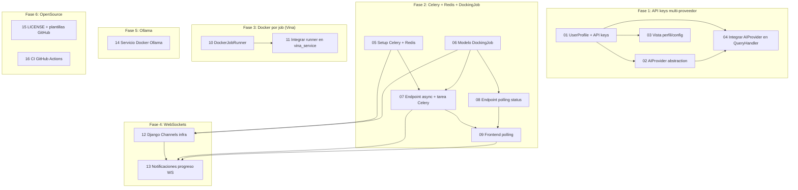

# Índice de planes de implementación — RePo-SUDOE-AI_v2

Este directorio contiene 16 planes de trabajo "agent-ready": documentos autocontenidos pensados para que un agente de codificación SIN contexto previo del proyecto pueda leer uno solo y ejecutarlo de principio a fin, sin ambigüedad. Cada archivo `NN_nombre.md` sigue la misma estructura fija (Contexto, Objetivo, Pre-requisitos, Archivos a crear/modificar, Especificación detallada, Dependencias nuevas, Criterios de aceptación, Fuera de alcance) y representa una unidad de trabajo del tamaño de un "PR" (aprox. 1-4 horas de trabajo de un agente).

El plan completo deriva de `../ROADMAP.md` (6 fases: API keys multi-proveedor, Celery+Redis, Docker-por-job para Vina, WebSockets, Ollama, preparación OpenSource). Cada tarea referencia `ROADMAP.md` para contexto adicional sobre la fase a la que pertenece.

**Importante para quien orquesta los agentes**: cada agente debe trabajar en su propia rama/PR. Varias tareas modifican el mismo archivo (típicamente `config/settings.py`, `requirements.txt` o `docker-compose.yml`) en secciones distintas — esto es intencionado (cada tarea añade su propio bloque de configuración) pero significa que, si dos PRs que tocan el mismo archivo se desarrollan en paralelo, habrá que resolver un conflicto de fusión (normalmente trivial: dos bloques añadidos en sitios distintos del mismo archivo) al integrarlos. La tabla y los grupos de paralelización de abajo señalan estos casos.

## Tabla de tareas

| # | Archivo | Fase del ROADMAP | Dependencias (otras tareas) | Dificultad estimada | Orden recomendado |
|---|---------|-------------------|------------------------------|----------------------|---------------------|
| 01 | `01_modelo_userprofile_apikey.md` | Fase 1 — API keys multi-proveedor | Ninguna | Media (modelo + señal + migración + admin + cifrado) | 1 |
| 02 | `02_abstraccion_ai_provider.md` | Fase 1 — API keys multi-proveedor | 01 | Media-Alta (4 proveedores + factory) | 3 |
| 03 | `03_vista_perfil_configuracion.md` | Fase 1 — API keys multi-proveedor | 01 | Baja-Media (form + view + template) | 3 |
| 04 | `04_integracion_ai_provider_query_handler.md` | Fase 1 — API keys multi-proveedor | 01, 02 | Media (refactor de 3 métodos + 6 puntos de instanciación) | 5 |
| 05 | `05_setup_celery_redis.md` | Fase 2 — Celery + Redis | Ninguna | Baja-Media (config Celery + docker-compose) | 1 |
| 06 | `06_modelo_dockingjob.md` | Fase 2 — Celery + Redis | Ninguna | Baja (modelo + admin + migración) | 1 |
| 07 | `07_endpoint_docking_async_y_task.md` | Fase 2 — Celery + Redis | 05, 06 | Media-Alta (refactor `handle_docking_flow` + tarea Celery) | 4 |
| 08 | `08_polling_status_api.md` | Fase 2 — Celery + Redis | 06 | Baja (un endpoint de solo lectura) | 3 |
| 09 | `09_frontend_polling_progreso.md` | Fase 2 — Celery + Redis | 07, 08 | Media (servicio de polling + integración en `chat.ts`) | 5 |
| 10 | `10_docker_job_runner_vina.md` | Fase 3 — Docker por job (Vina) | Ninguna | Media-Alta (Docker SDK, límites de recursos) | 1 |
| 11 | `11_integracion_docker_runner_tasks.md` | Fase 3 — Docker por job (Vina) | 10 | Alta (refactor `vina_service.py`, dirs efímeros, DooD) | 3 |
| 12 | `12_websockets_django_channels.md` | Fase 4 — WebSockets | 05, 06 | Media-Alta (Channels + Daphne + ASGI + consumer) | 4 |
| 13 | `13_notificaciones_progreso_websocket.md` | Fase 4 — WebSockets | 07, 09, 12 | Media-Alta (Celery → grupo Channels → `jobSocket.ts` → `chat.ts`) | 6 |
| 14 | `14_servicio_ollama_docker.md` | Fase 5 — Ollama | Ninguna (e2e completo requiere 01+02) | Baja-Media (servicio Docker + `.env.example` + docs) | 1 |
| 15 | `15_licencia_y_plantillas_github.md` | Fase 6 — OpenSource | Ninguna | Baja (LICENSE + plantillas `.github/`) | 1 |
| 16 | `16_ci_github_actions.md` | Fase 6 — OpenSource | Ninguna (recomendado al final) | Media (workflow CI + setup lint backend/frontend) | 7 (último) |

La columna "Orden recomendado" agrupa tareas en "oleadas" (1 = se puede empezar de inmediato; números mayores = oleadas posteriores). Varias tareas comparten número de oleada porque pueden ejecutarse en paralelo entre sí.

## Diagrama de dependencias



### Resumen textual de "oleadas" (waves)

```
Oleada 1 (sin dependencias - 6 tareas en paralelo):
  01, 05, 06, 10, 14, 15

Oleada 2 (dependen solo de la oleada 1):
  02  <- 01
  03  <- 01
  08  <- 06
  11  <- 10
  12  <- 05, 06

Oleada 3 (dependen de oleadas 1-2):
  04  <- 01, 02
  07  <- 05, 06

Oleada 4:
  09  <- 07, 08

Oleada 5:
  13  <- 07, 09, 12

Oleada final (recomendada al cierre, aunque sin dependencias formales):
  16  <- (ninguna, pero `manage.py test` en CI es más útil
          una vez integradas el resto de tareas)
```

## Recomendaciones de paralelización (agentes simultáneos)

### Se pueden lanzar en paralelo SIN conflicto de archivos

- **01, 06, 10, 14, 15** — no comparten ningún archivo entre sí. Pueden lanzarse 5 agentes simultáneos desde el principio.
- **05** también puede lanzarse en la oleada 1, pero ten en cuenta que **01, 02, 05, 10 y 11 modifican `requirements.txt` y/o `config/settings.py`** (cada uno añade su propio bloque independiente). Si se ejecutan en paralelo, al fusionar las ramas habrá conflictos de fusión menores (líneas añadidas en distintos puntos del mismo archivo) que se resuelven a mano sin pérdida de información — no son conflictos lógicos.
- **02 y 03** (ambas dependen solo de 01): pueden ejecutarse en paralelo entre sí una vez 01 esté mergeado — no comparten archivos (02 toca `core/services/ai_provider.py` + `config/settings.py`; 03 toca `accounts/forms.py`/`views.py`/`urls.py`/templates).
- **08 y 07** (ambas dependen de 06; 07 además de 05): pueden ejecutarse en paralelo — 07 toca `core/services/query_handler.py` y `core/tasks.py`; 08 toca `core/views.py` y `core/urls.py`. Sin solapamiento.
- **11** (depende solo de 10) puede ejecutarse en paralelo con TODA la Fase 2 (05-09) y con la Fase 1 (01-04) — no comparte archivos con ninguna de ellas.
- **12** (depende de 05 y 06) puede ejecutarse en paralelo con 07/08 una vez 05 y 06 estén mergeados — 12 toca `config/settings.py` (bloque `CHANNEL_LAYERS`/`ASGI_APPLICATION`/`INSTALLED_APPS`), `config/asgi.py`, `core/routing.py`, `core/consumers.py`, `docker-compose.yml`; ningún solapamiento directo con `core/tasks.py` (07) salvo el archivo compartido `config/settings.py`/`docker-compose.yml` (conflicto de fusión menor, no lógico).
- **15 y 16** pueden ejecutarse en paralelo entre sí (no comparten archivos: 15 toca `LICENSE`+`.github/ISSUE_TEMPLATE/`+`.github/pull_request_template.md`; 16 toca `.github/workflows/`+`setup.cfg`+`requirements-dev.txt`+`frontend/`).
- **14** es independiente de prácticamente todo (`docker-compose.yml`, `.env.example`, `README.md`) — único punto de fusión compartido es `docker-compose.yml` con 05/11/12.

### Deben ejecutarse de forma SECUENCIAL (dependencia real, no solo de archivo)

- `01 -> 02 -> 04` y `01 -> 04` (04 necesita tanto el modelo de 01 como el módulo `ai_provider.py` de 02).
- `05, 06 -> 07 -> 09` y `06 -> 08 -> 09` (09 necesita la respuesta `job_started` de 07 Y el endpoint de 08).
- `10 -> 11` (11 reescribe `vina_service.py` para usar la clase `DockerJobRunner` de 10).
- `05, 06 -> 12 -> 13`, y además `07, 09 -> 13` (13 es la tarea con más dependencias: necesita la infraestructura de Channels de 12, la tarea Celery de 07, y el polling/`chat.ts` de 09 como mecanismo de fallback).
- `16` se recomienda al final porque su job `backend` ejecuta `python manage.py test` sobre TODO el código — es más útil (y más probable que pase a la primera) una vez integradas el resto de tareas. No es un bloqueo estricto: puede ejecutarse antes, pero es probable que el CI falle de forma intermitente hasta que las demás tareas estén mergeadas, lo cual es esperado.

### Resumen por fases (para planificación a alto nivel)

- **Fase 1** (4 tareas, 01-04): secuencia mínima `01 -> {02, 03 en paralelo} -> 04`. Tiempo total si hay agentes suficientes: ~3 oleadas.
- **Fase 2** (5 tareas, 05-09): `{05, 06 en paralelo} -> {07, 08 en paralelo} -> 09`. ~3 oleadas.
- **Fase 3** (2 tareas, 10-11): `10 -> 11`. ~2 oleadas. Totalmente independiente de Fases 1, 2, 4.
- **Fase 4** (2 tareas, 12-13): `{05,06} -> 12 -> 13` (13 también espera a 07 y 09 de la Fase 2).
- **Fase 5** (1 tarea, 14): independiente, se puede hacer en cualquier momento.
- **Fase 6** (2 tareas, 15-16): 15 en cualquier momento; 16 al final.

## Archivos creados en este directorio

- `00_INDEX.md` — este documento.
- `01_modelo_userprofile_apikey.md` — modelo `UserProfile` con campos `ai_provider`/`encrypted_api_key`/`ai_model`/`ollama_base_url` cifrados con `django-cryptography`, señal de creación automática y registro en admin.
- `02_abstraccion_ai_provider.md` — clase abstracta `AIProvider` y subclases OpenAI/Anthropic/Google/Ollama + factory `get_ai_provider_for_user()`.
- `03_vista_perfil_configuracion.md` — formulario y vista para que el usuario configure su proveedor de IA y API key desde el perfil.
- `04_integracion_ai_provider_query_handler.md` — sustituye el cliente de IA hardcodeado de `QueryHandler` por `get_ai_provider_for_user()` en los 6 puntos donde se instancia.
- `05_setup_celery_redis.md` — configuración de Celery + Redis (`config/celery.py`, settings, servicios `redis`/`celery_worker` en `docker-compose.yml`).
- `06_modelo_dockingjob.md` — modelo `DockingJob` (estado, progreso, resultados) con métodos `mark_running`/`mark_completed`/`mark_failed`.
- `07_endpoint_docking_async_y_task.md` — tarea Celery `run_docking_job` y refactor de `handle_docking_flow` para lanzarla de forma asíncrona.
- `08_polling_status_api.md` — endpoint `GET /core/api/docking-job/<uuid:job_id>/status/` de solo lectura sobre `DockingJob`.
- `09_frontend_polling_progreso.md` — `jobPolling.ts` y manejo del mensaje `job_started` en `chat.ts` para hacer polling del estado del job.
- `10_docker_job_runner_vina.md` — clase `DockerJobRunner` (Docker SDK) que ejecuta AutoDock Vina en contenedores efímeros con límites de CPU/memoria/timeout.
- `11_integracion_docker_runner_tasks.md` — integra `DockerJobRunner` en `DockerVinaService`, con directorios de entrada/salida efímeros por job y patrón Docker-out-of-Docker.
- `12_websockets_django_channels.md` — infraestructura Django Channels + Daphne (ASGI, `core/routing.py`, `core/consumers.py`, `CHANNEL_LAYERS` sobre Redis).
- `13_notificaciones_progreso_websocket.md` — conecta `core/tasks.run_docking_job` con el consumer de Channels (`_notify_job_progress`) y añade `jobSocket.ts` con fallback automático a polling.
- `14_servicio_ollama_docker.md` — añade el servicio Docker `ollama`, corrige `OLLAMA_BASE_URL` para la red Docker y documenta modelos recomendados en `README.md`.
- `15_licencia_y_plantillas_github.md` — crea `LICENSE` (Apache 2.0) y las plantillas `.github/ISSUE_TEMPLATE/`+`pull_request_template.md` ya referenciadas por `CONTRIBUTING.md`.
- `16_ci_github_actions.md` — workflow `.github/workflows/ci.yml` (lint+tests backend, type-check+lint+build frontend) más la configuración de `flake8`/`black`/`isort`/ESLint que faltaba.
